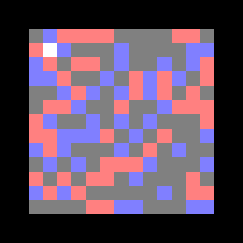
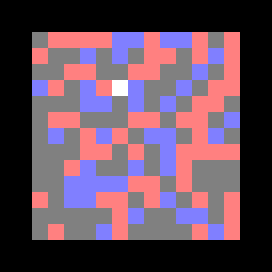

# Deep Reinforcement Learning

The goal is to make an agent learn the game "Eat cheese". A rat runs on an island and tries to eat as much as possible. The island is subdivided into $N \times N$ celles, in which there are cheese ($+ 0.5$) and poisonous cells ($-1$). The rat has a visibility of $2$ cells (thus it can see $5^2$ cells). The rat is given a time $T$ to accumulate as much food as possible. It can perform $4$ actions: going up, down, left, right.

Here is the policy obtained with different architectures:

- A Multi-Layer Perceptron:

- A Convolutional Neural Network:

- A Convolutional Neural Network with a malus for the cells visited several times (to enforce exploration):
